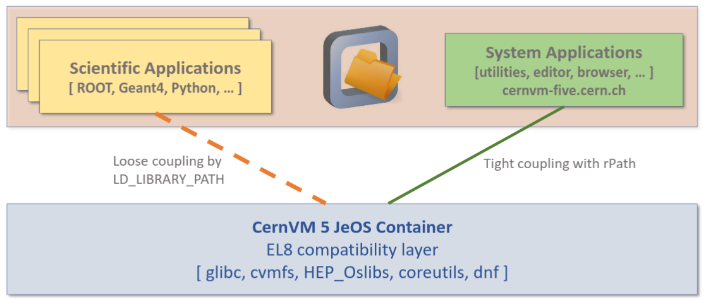

# CernVM 5

- [About CernVM 5](#about-cernvm-5)
  - [CernVM-FS](#cernvm-fs)
  - [Host integration](#host-integration)
- [Building the image](#building-the-image)
  - [With Docker](#with-docker)
  - [With Buildah](#with-buildahhttpsbuildahio-in-for-eg-in-a-build-containerhttpsgithubcomcontainersbuildah)
- [Pulling from CERN Harbor](#pulling-from-cern-harbor)
  - [Deriving from the image](#deriving-from-the-image)
- [Running the image as a container](#running-the-image-as-a-container)
  - [Using Docker](#using-docker)
  - [Using Podman](#using-podman)
  - [Using Singularity and unpacked.cern.ch](#using-singularity-and-unpackedcernch)
---
## About CernVM 5
This repository contains the source code and build scripts for the EL8-based CernVM 5 container image. 
The image is intended to be a JeOS (Just enough OS) and provides:

 - A [CernVM File System](https://cernvm.cern.ch/fs/) client with its minimal dependencies
 - The [HEP_OSlibs](https://gitlab.cern.ch/linuxsupport/rpms/HEP_OSlibs) meta package

### CernVM-FS
For most Use Cases it is sensible to run the image with CernVM-FS either mounted from the host or from the inside of the container. 

 - The repository cernvm-five.cern.ch provides common **System Applications** like editors, browsers or cloud tools. 
 - Other repositories with **Scientific Applications** can be mounted as usual.
  
 

> **_NOTE:_**  System Applications don't use LD_LIBRARY_PATH and therefore can be run in parallel to other applications from other repositories safely.

 

### Host integration
Besides /cvmfs the image comes with two more dedicated host mount points:

  - **/workspace** as a shared folder between container and host
  - **/data** for data integration with for e.g. EOS

---
## Building the image

### With Docker 
    docker build -f docker/Dockerfile . -t cernvm-five

### With [Buildah](https://buildah.io/) in for e.g., [in a build container](https://github.com/containers/buildah)

    buildah bud -t cernvm-five -f docker/Dockerfile .  

## Pulling from CERN Harbor 

    docker pull registry.cern.ch/cernvm/five/cernvm-five:latest
### Deriving from the image

CernVM 5 can serve as a base layer for custom container images. For e.g. use
    
    FROM registry.cern.ch/cernvm/five/cernvm-five:latest
    RUN dnf install mypackage
    COPY /my_init.sh / 
    ENTRYPOINT ["bash", "/my_init.sh"]

to extend the image as you wish.

---
## Running the image as a container 
Make sure to use the [dedicated mountpoints](#host-integration) for host integration. It is recommended to run the image with either CernVM-FS mounted from the host or with an independent CernVM-FS client inside the container
### Using Docker
    docker run -it --cap-add SYS_ADMIN -v /cvmfs:/cvmfs:ro registry.cern.ch/cernvm/five/cernvm-five:latest bash

 

    docker run -it --device /dev/fuse --cap-add SYS_ADMIN registry.cern.ch/cernvm/five/cernvm-five:latest bash
    
### Using Podman  
    podman run -it --cap-add SYS_ADMIN -v /cvmfs:/cvmfs:ro registry.cern.ch/cernvm/five/cernvm-five:latest bash

 

    podman run -it --device /dev/fuse --cap-add SYS_ADMIN registry.cern.ch/cernvm/five/cernvm-five:latest bash

### Using [Singularity](https://sylabs.io/guides/3.5/user-guide/quick_start.html) and [unpacked.cern.ch](https://gitlab.cern.ch/unpacked/sync)
    singularity shell /cvmfs/unpacked.cern.ch/registry.cern.ch/cernvm/five/cernvm-five\:latest/