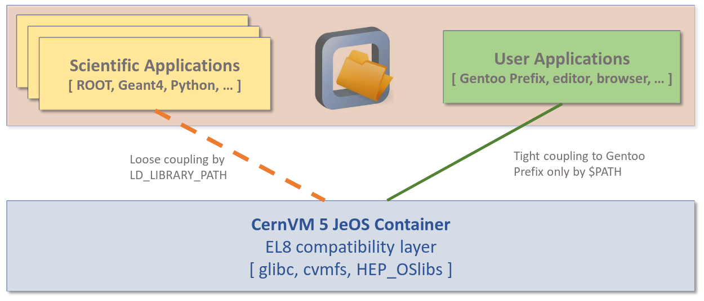

# cernvm-five

This repository contains the source code and build scripts for the EL8-based CernVM 5 container image. 
The image is intended to be a JeOS (Just enough OS) and provides:

 - A CernVM Filesystem client with its minimal dependencies
 - HEP_OSlibs
 

